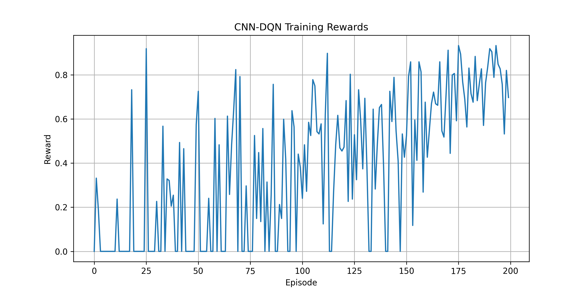
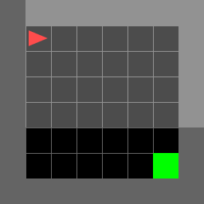

# Vision-Based Autonomous Navigation using Deep Reinforcement Learning

## Overview

This project presents a **Vision-Based Reinforcement Learning (RL) framework** for autonomous navigation using **Deep Q-Networks (DQN)**. The primary objective is to train an intelligent agent that learns navigation policies directly from visual observations without relying on handcrafted rules or predefined paths.

The agent receives image-based observations from a simulated environment and learns to select optimal actions through trial-and-error interactions. The project integrates concepts from **Computer Vision**, **Deep Learning**, **Reinforcement Learning**, and **Robotics**, making it a valuable stepping stone toward real-world autonomous robotic systems.

This project was developed as a hands-on exploration of how perception and decision-making can be combined to enable autonomous navigation.

---

# Motivation

Traditional robotic navigation systems often depend on manually engineered features, path-planning algorithms, and environment-specific heuristics.

Recent advances in Deep Reinforcement Learning have demonstrated that agents can learn navigation policies directly from sensory inputs, enabling greater adaptability and autonomy.

The motivation behind this project was to:

* Understand the practical implementation of Deep Reinforcement Learning.
* Explore how visual perception can be integrated into RL-based navigation.
* Gain hands-on experience with Deep Q-Networks (DQN).
* Build a complete end-to-end perception-to-action pipeline.
* Develop a project relevant to robotics, autonomous systems, and intelligent agents.

---

# Problem Statement

Given only visual observations of the environment, train an autonomous agent to navigate efficiently toward a goal location.

The agent must:

1. Observe the environment through image inputs.
2. Learn useful visual representations.
3. Estimate the value of available actions.
4. Select actions that maximize cumulative future rewards.
5. Reach the target location successfully.

The challenge lies in learning both perception and decision-making simultaneously.

---

# Project Objectives

* Develop a vision-based navigation agent using Reinforcement Learning.
* Implement Deep Q-Networks (DQN) from scratch.
* Train the agent using image observations.
* Utilize Experience Replay for stable learning.
* Implement a Target Network for training stability.
* Analyze learning behavior through reward curves.
* Evaluate policy performance after training.
* Understand challenges associated with visual RL systems.

---

# Reinforcement Learning Background

Reinforcement Learning is a machine learning paradigm in which an agent learns by interacting with an environment.

At every timestep:

* The agent observes a state.
* Chooses an action.
* Receives a reward.
* Transitions to a new state.

The objective is to maximize the cumulative reward over time.

### RL Components Used

| Component   | Description                     |
| ----------- | ------------------------------- |
| Agent       | Learns navigation policy        |
| Environment | MiniGrid Navigation Environment |
| State       | Visual image observation        |
| Action      | Navigation commands             |
| Reward      | Feedback from environment       |
| Policy      | Mapping from state to action    |
| Q-Function  | Expected future reward          |

---

# Deep Q-Network (DQN)

Traditional Q-Learning becomes impractical for large state spaces because maintaining a Q-table is impossible.

Deep Q-Networks solve this problem by using a neural network to approximate Q-values.

The DQN predicts:

Q(s,a)

for every possible action.

The action with the highest Q-value is selected.

### Key Concepts Implemented

#### Experience Replay

Instead of learning from consecutive experiences:

* Experiences are stored in a replay buffer.
* Mini-batches are sampled randomly.
* Reduces correlation between samples.
* Improves training stability.

#### Target Network

A separate target network is maintained to compute stable target Q-values.

Benefits:

* Reduces oscillations.
* Improves convergence.
* Prevents divergence during training.

#### Epsilon-Greedy Exploration

The agent balances:

* Exploration
* Exploitation

using an epsilon-greedy strategy.

Initially:

* High exploration.

Later:

* Increased exploitation of learned policies.

---

# Environment

The project uses the MiniGrid environment from Gymnasium.

### Environment Used

```python
MiniGrid-Empty-8x8-v0
```

The environment consists of:

* A grid-based world.
* An agent.
* A target goal location.

The objective is to navigate from the starting position to the goal using visual observations.

---

# Observation Space

The environment provides image-based observations.

Observation dimensions:

```python
(7, 7, 3)
```

These observations are processed and converted into a format suitable for CNN input:

```python
(3, 7, 7)
```

using channel-first representation.

---

# Action Space

The environment provides 7 discrete actions.

Examples include:

* Turn Left
* Turn Right
* Move Forward
* Pickup
* Drop
* Toggle
* Done

The DQN predicts a Q-value for each action.

---

# Model Architecture

The project uses a Convolutional Neural Network (CNN) as the perception backbone.

## CNN Feature Extractor

### Convolution Layer 1

```python
Conv2D(3 → 32)
```

### Convolution Layer 2

```python
Conv2D(32 → 64)
```

### Convolution Layer 3

```python
Conv2D(64 → 64)
```

Each layer is followed by:

```python
ReLU Activation
```

The extracted features are flattened and passed to fully connected layers.

---

## Fully Connected Layers

```python
Linear → 512
ReLU
Linear → Number of Actions
```

Output:

```python
Q-values for all actions
```

---

# Project Architecture

```text
Environment

    ↓

Visual Observation

    ↓

Preprocessing

    ↓

CNN Feature Extractor

    ↓

Deep Q-Network

    ↓

Q Values

    ↓

Action Selection

    ↓

Environment Interaction

    ↓

Reward

    ↓

Replay Buffer

    ↓

Network Update
```

---

# Training Pipeline

The complete training workflow consists of:

### Step 1

Initialize environment.

### Step 2

Receive visual observation.

### Step 3

Select action using epsilon-greedy policy.

### Step 4

Execute action.

### Step 5

Observe reward and next state.

### Step 6

Store experience in replay buffer.

### Step 7

Sample mini-batch.

### Step 8

Compute target Q-values.

### Step 9

Perform gradient descent update.

### Step 10

Periodically update target network.

---

# Hyperparameters

| Hyperparameter          | Value       |
| ----------------------- | ----------- |
| Episodes                | 200         |
| Batch Size              | 32          |
| Replay Buffer Size      | 50,000      |
| Learning Rate           | 0.0001      |
| Gamma                   | 0.99        |
| Epsilon Start           | 1.0         |
| Epsilon Minimum         | 0.05        |
| Epsilon Decay           | 0.995       |
| Target Update Frequency | 10 Episodes |

---

# Results

The agent demonstrated progressive learning throughout training.

### Observations

* Initial episodes showed mostly random behavior.
* Reward frequency increased as training progressed.
* The agent learned navigation strategies through interaction.
* Higher rewards became more consistent in later episodes.

### Best Observed Reward

```text
0.93
```

### Typical Late-Training Rewards

```text
0.70 – 0.93
```

---

# Reward Curve

The reward curve illustrates the learning progress of the agent over training episodes.

Key observations:

* Sparse rewards in early stages.
* Increased reward frequency during later stages.
* Evidence of policy improvement over time.

Reward visualization:




---

# Demo

A demonstration GIF was generated to visualize agent behavior.

File:




The GIF shows the trained agent interacting with the environment using the learned policy.

---

# Challenges Encountered

During development several challenges were encountered:

### Sparse Rewards

The agent received rewards only when reaching the goal.

### Exploration Difficulties

Balancing exploration and exploitation required careful tuning.

### Training Instability

DQN can be unstable due to changing target values.

### Computational Constraints

Training was performed entirely on CPU, resulting in longer training times.

---

# Lessons Learned

This project provided practical experience with:

* Reinforcement Learning fundamentals.
* Deep Q-Network implementation.
* CNN-based visual perception.
* Experience Replay mechanisms.
* Target Network stabilization.
* Training and debugging RL systems.
* Performance evaluation of learned policies.

It also highlighted the challenges of applying RL to visual navigation problems.

---

# Future Improvements

Potential future extensions include:

* Double DQN
* Dueling DQN
* Prioritized Experience Replay
* PPO (Proximal Policy Optimization)
* Actor-Critic Methods
* Dynamic Obstacle Avoidance
* Multi-Room Navigation
* Sim-to-Real Transfer
* Integration with physical robotic platforms

---

# Technologies Used

### Programming Language

* Python

### Deep Learning

* PyTorch

### Reinforcement Learning

* Deep Q-Network (DQN)

### Simulation Environment

* Gymnasium
* MiniGrid

### Data Processing

* NumPy

### Visualization

* Matplotlib

### Development Tools

* PyCharm
* Git
* GitHub

---

# Repository Structure

```text
Vision_RL_Robot/

├── agent/
│   └── dqn_agent.py
│
├── models/
│   └── dqn.py
│
├── utils/
│   ├── preprocess.py
│   └── replay_buffer.py
│
├── train.py
├── evaluate.py
├── record_demo.py
│
├── best_model.pth
├── rewards.npy
│
├── reward_curve.png
├── navigation_demo.gif
│
├── requirements.txt
│
└── README.md
```

---

# Conclusion

This project demonstrates the implementation of a complete vision-based reinforcement learning pipeline for autonomous navigation. By combining convolutional neural networks with Deep Q-Networks, the agent learns navigation policies directly from visual observations without handcrafted features or explicit path-planning algorithms.

The project serves as a practical exploration of how perception and decision-making can be integrated into intelligent autonomous systems and provides a foundation for future work in robotics, reinforcement learning, and autonomous navigation.
